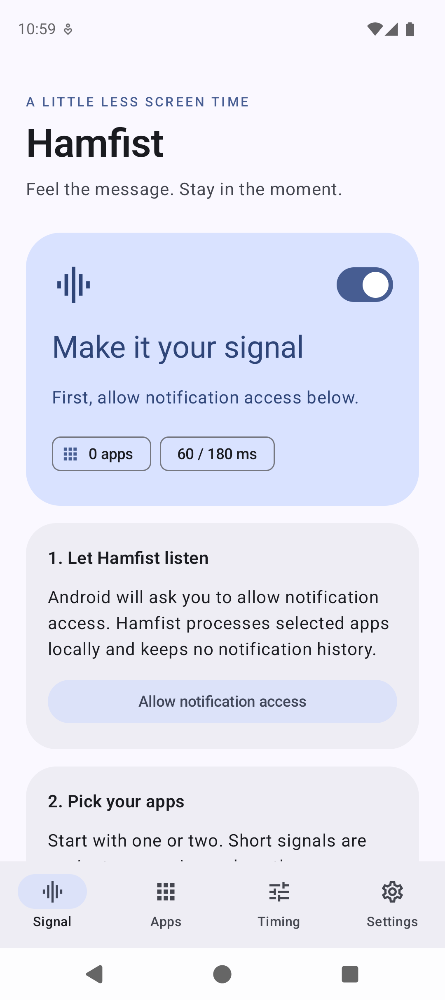
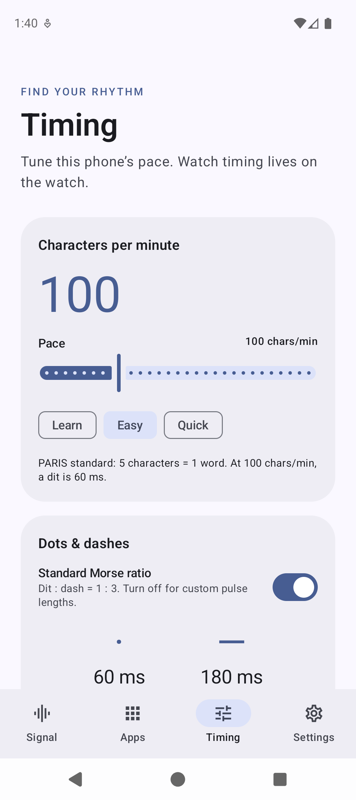
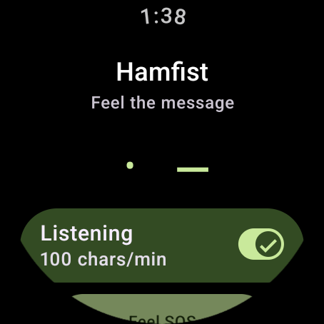

# Hamfist

Feel selected notifications in Morse code on an Android phone or a Wear OS watch.

Native Kotlin / Jetpack Compose, Material You on phones, and Wear Material 3 on watches. Phone and watch install separately, use the same application ID/signing key for the Wear Data Layer, and share one tested Morse engine. Android 11+ / Wear OS 3+; designed for Pixel Watch.

  

## What it does

- Explicit per-app allowlist, searchable launcher app list, and manual package entry on the phone.
- App-name signals with optional short codes, title/sender, message, or title + message.
- Phone, watch, or both as destinations. The watch also supports notifications from selected locally installed watch apps.
- 20–300 characters/minute, standard 1:3 dit/dash timing, or custom 20–500 ms dits and 20–1500 ms dashes.
- Phone and watch have independent timing, pause, limits and quiet-hour settings; settings are stored immediately on that device. Phone-side content and app selection control what is forwarded.
- Quiet hours across midnight, respect silent mode, always respect DND, pause in Battery Saver, configurable low-battery threshold, per-app cooldown, max characters and total duration. A configurable 0–2000 ms start delay lets an app’s original buzz finish first.
- Preview, stop, and a Morse alphabet reference on the phone; SOS and PARIS previews on the watch.

## Build and install

Download the phone and watch APKs from [GitHub Releases](https://github.com/j6k4m8/hamfist/releases). Pushing a new `vX.Y.Z` tag runs tests, builds and signs both APKs, and attaches them with checksums to a release. See [release instructions](docs/RELEASING.md) for signing and versioning. A debug installation must be uninstalled once before switching to a release APK because the signing certificates differ.

Use JDK 21 (Android Studio’s bundled JBR works), Android SDK 36 and the included Gradle wrapper. Set `ANDROID_HOME` or create an untracked `local.properties` with `sdk.dir=/path/to/Android/sdk`.

```sh
./gradlew :core:test :phone:assembleDebug :wear:assembleDebug :phone:lintDebug :wear:lintDebug
adb -s PHONE_SERIAL install -r phone/build/outputs/apk/debug/phone-debug.apk
adb -s WATCH_SERIAL install -r wear/build/outputs/apk/debug/wear-debug.apk
```

For a physical Pixel Watch, enable developer options and Wireless debugging, pair with `adb pair IP:PAIR_PORT`, then connect with `adb connect IP:DEBUG_PORT`. Pairing and debugging ports differ. Install both APKs built with the same debug certificate. Release distribution also needs matching signing certificates, with separate phone and Wear artifacts.

1. Open Hamfist on the phone and allow **notification access** in Android settings. For sideloads, Android may require **Allow restricted settings** in the app’s system App info menu first.
2. Choose apps. The default signal is the notification title/sender; use **Settings → App name** and short codes for the shortest signals.
3. Turn on **This phone**, **Pixel Watch / Wear OS**, or both. A phone alone needs no watch and no Google account in Hamfist.
4. Open Hamfist on the paired watch once. Incoming phone messages use its own timing and safety settings. The watch doesn’t need notification listener access for phone-forwarded messages.
5. For native watch notifications, grant notification access on the watch and select apps under **Watch apps**. Leave that list empty if you only want the phone relay, avoiding duplicate delivery from bridged/native notifications.

Hamfist adds Morse; it cannot suppress another app’s original buzz. Adjust the original apps’ alert settings or watch mirroring in the Pixel Watch companion app if you want Morse alone. Android can redact sensitive notification content and may exclude work-profile notifications. Only information Android exposes to the notification listener can be encoded.

## Timing

CPM uses the standard PARIS reference word: five characters occupy 50 dit units including the trailing word gap. Standard timing uses `dit = 6000 / CPM` milliseconds, `dash = 3 × dit`, intra-symbol gap = 1 dit, letter gap = 3 dits, word gap = 7 dits. Arbitrary text varies in duration.

In custom mode, dit/dash pulses stay fixed. Farnsworth spacing expands letter/word gaps to reach a slower requested CPM. A requested speed above what the chosen pulse widths permit is physically impossible; the UI shows the attainable effective CPM. Long text is truncated at a complete Morse character, never mid-dash. Latin accents are folded, A–Z/0–9 and common punctuation are encoded, and unsupported scripts/emoji become word separators.

## Battery and privacy

NotificationListenerService and a narrowly filtered WearableListenerService react to events. No polling, periodic jobs, foreground service, screen wake, sensor tracking, analytics, database or notification history. Each accepted message is submitted as one non-repeating waveform to Android’s vibrator service. Phone playback uses notification attributes. Wear OS reserves generic notification vibrations for its notification collector, so the watch uses the public `USAGE_COMMUNICATION_REQUEST` for the tactile communication prompt, after explicitly checking DND and the user’s safety settings. No interruption-bypass flags or privileged permissions are used.

Screen-off delivery is intentional. A **partial (CPU-only) wake lock** covers just the configurable start delay and vibrator handoff—500 ms by default, at most 2000 ms, with an automatic timeout of delay + 1000 ms. It never wakes the display and is released immediately after submitting the waveform; the system vibrator service owns playback after that. Pausing or stopping cancels a pending handoff and releases the hold. There is at most one pending signal, with no catch-up queue. The short delay avoids competing with the source notification’s normal vibration. Long custom source buzzes may still override Morse; disable those original vibrations if needed.

The handoff uses a sleeping background handler so a busy UI cannot delay it. Pending signals recheck the current destination and safety settings; local notifications also recheck app selection and notification access. A signal that misses its handoff deadline is discarded.

Defaults: 40 characters, at most 20 seconds per signal, 10-second per-app cooldown, no ongoing or low-importance notifications, no playback in Battery Saver or at/below 15% battery while unplugged. Group summaries and unchanged content updates are ignored. A busy motor drops new incoming messages; there is no playback queue. All caches are bounded and memory-only.

The phone sends normalized, truncated text only after filtering. Wear MessageClient targets one reachable Hamfist watch (preferring a nearby watch); it does not retain missed messages for later delivery. The receiver additionally rejects messages older than 30 seconds, oversized/invalid payloads and duplicate IDs. Google Play services manages the paired-device transport; Hamfist has no backend or account. No raw notification text is logged or persisted by the app. App choices and preferences stay on-device, with cloud backup and device transfer disabled.

Phone relay requests retain their original timestamp while finding the watch. Before sending, they recheck age, pause, destination, app selection, notification access and safety settings. A slow lookup cannot turn a stale notification into a fresh one.

This architecture reduces unnecessary work; actual battery use depends chiefly on vibration duration/frequency and radio conditions. Hardware power consumption and how well 20–60 ms pulses can be felt need testing on your watch.

## Project layout and validation

- `core/`: pure Kotlin Morse timing, normalization, quiet-hours logic and bounded duplicate/rate gate; JVM tests.
- `shared/`: notification filtering, preferences, app discovery, vibrator playback and Wear transport.
- `phone/`: Material You setup, app picker, preview, timing and settings.
- `wear/`: round-screen Wear Material 3 controls with rotary scrolling and local app selection.
- `scripts/emulator_smoke.py`: real notification-to-vibrator integration test, restricted to emulator serials; restores Hamfist settings/access afterward.
- `docs/VALIDATION.md`: tested behavior, hardware follow-up checklist and limitations.
- `docs/SELF_REVIEW.md`: review findings, fixes and regression evidence.

```sh
python3 scripts/emulator_smoke.py emulator-5556
python3 scripts/emulator_smoke.py emulator-5554 --wear
python3 scripts/emulator_smoke.py emulator-5554 --wear --screen-off
ANDROID_SERIAL=emulator-5554 ./gradlew :wear:connectedDebugAndroidTest
```

Official API references: [Wear Data Layer events](https://developer.android.com/training/wearables/data/events), [client types and message delivery](https://developer.android.com/training/wearables/data/client-types), [Android vibration APIs](https://developer.android.com/develop/ui/views/haptics/haptics-apis), [Wear Material 3](https://developer.android.com/jetpack/androidx/releases/wear-compose).
